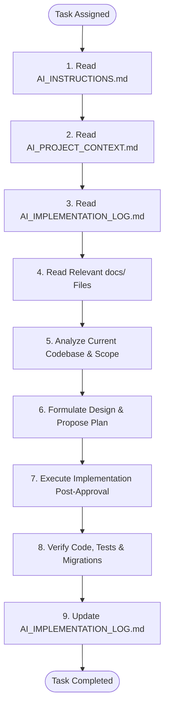

# AI Engineering Instructions & Governance

> [!IMPORTANT]
> **CRITICAL EXECUTION RULE**  
> Before making any implementation decisions or generating/modifying code, you **MUST** read:
> 1.  **[AI_INSTRUCTIONS.md](file:///S:/Dev/creatorOps/AI_INSTRUCTIONS.md)** (This rulebook)
> 2.  **[AI_PROJECT_CONTEXT.md](file:///S:/Dev/creatorOps/AI_PROJECT_CONTEXT.md)** (Project memory & tech stack)
> 3.  **[AI_IMPLEMENTATION_LOG.md](file:///S:/Dev/creatorOps/AI_IMPLEMENTATION_LOG.md)** (Chronological updates & history)
>
> And all referenced project documentation under `docs/`.

---

## 1. Project Philosophy

CreatorOps is designed to be a high-performance, production-quality SaaS portfolio application. Maintainability, simplicity, and readability are prioritized over academic patterns.
*   **Simplicity First**: Write code that is easy to understand, debug, and refactor.
*   **Avoid Over-Engineering**: Do not introduce architectural layers, patterns, or abstractions until there is a concrete, immediate requirement for them.
*   **No Premature Optimization**: Focus on clean algorithms, simple database joins, and readable queries. Address performance bottlenecks only after they are demonstrated via metrics.
*   **Architectural Consistency**: Adhere strictly to the established design models for REST API conventions, database schemas, and tenancy.

---

## 2. Core Engineering Principles

*   **SOLID**:
    *   *Single Responsibility*: Classes (particularly services and components) must focus on one core business job.
    *   *Interface Segregation*: Prefer small, target-focused interfaces (e.g. `AiProviderGateway`) rather than monolithic ones.
*   **DRY (Don't Repeat Yourself)**: Extract common logic into shared helpers (e.g. global exception handlers, prompt template managers), but do not over-abstract to the point of unreadability.
*   **KISS (Keep It Simple, Stupid)**: Favor simple loops, standard libraries, and direct method calls over dynamic proxies, reflection, or overly complex configurations.
*   **YAGNI (You Aren't Gonna Need It)**: Do not write code or set up configurations for hypothetical future features. Build what is needed for the current task scope only.
*   **Clean Code**: Write self-documenting code with clear variable and method names. Comments should explain *why* something is done, not *what* the code does.

---

## 3. Java 21 Coding Standards

*   **Records**: Use Java `record` classes for all read-only data structures, data transfer objects (DTOs), and value objects.
*   **Immutability**: Declare fields as `final` by default. Minimize setter methods in entities and favor builder patterns or constructor initialization.
*   **Enums**: Use Enums for all multi-state attributes (e.g. content `stage`, priority `level`, user `role`).
*   **Naming Conventions**:
    *   Classes and Interfaces: CamelCase (e.g. `ScriptService`).
    *   Variables and Methods: mixedCamelCase (e.g. `generateScriptDraft`).
    *   Constants: UPPER_SNAKE_CASE (e.g. `MAX_RETRY_LIMIT`).
*   **Package Organization**: Group classes by functional subdomain rather than technical layer:
    *   *Correct*: `com.creatorops.domain.content` containing controller, service, repository, and DTOs.
    *   *Incorrect*: A flat `com.creatorops.controllers` containing controllers for every domain.
*   **Exception Handling**:
    *   Never swallow exceptions (`catch (Exception e) {}` is forbidden).
    *   Throw specific, custom runtime domain exceptions (e.g. `ContentNotFoundException`) rather than generic `RuntimeException`.

---

## 4. Spring Boot 3.x Rules

*   **Controllers**: Keep controllers thin. They should handle only HTTP request parsing, input validation, authentication context extraction, and delegate execution to the service layer.
*   **Services**: Place all business logic, transactions, state machines, and integrations in Service implementations. Enforce transaction boundaries using `@Transactional`.
*   **Repositories**: Use Spring Data JPA repositories. Write custom queries using QueryDSL or JPQL for complex filtering. Do not write SQL logic inside repositories or services.
*   **DTOs**: Never expose JPA database entities directly to REST API endpoints. Utilize dedicated Request and Response DTOs.
*   **Validation**: Validate incoming REST requests using `jakarta.validation` constraints (e.g. `@NotNull`, `@NotBlank`, `@Size`, `@Email`) in controller endpoints.
*   **Global Exception Handling**: Route all service exceptions through a global `@ControllerAdvice` handler mapping custom domain exceptions into RFC 7807 Problem Details responses.
*   **Security**: Use Spring Security 6 configurations. Protect routes using declarative method-level permissions:
    *   `@PreAuthorize("hasRole('ADMIN')")`
    *   `@PreAuthorize("hasAnyRole('ADMIN', 'MANAGER')")`

---

## 5. Database & Schema Rules (PostgreSQL)

*   **Identifiers**: All table primary keys must use `BIGINT` (64-bit long) auto-incrementing serial values.
*   **Table and Column Naming**: Tables must use singular lowercase naming (e.g. `brand`, `content`). Columns must use lowercase snake_case (e.g. `is_deleted`).
*   **Timezones**: Store all datetime fields in UTC using `TIMESTAMPTZ` (Timestamp with Timezone).
*   **Enum Storage**: Save Java Enums to the database as strings (`VARCHAR(50)`) via `@Enumerated(EnumType.STRING)`. Never store enums as ordinals.
*   **Audit Fields**: Maintain audit logs by including `created_at` and `updated_at` timestamps on all tenant and content records. Update `updated_at` automatically using database triggers.
*   **Soft Delete**: Core entities (`organization`, `brand`, `content`) must support soft delete using `is_deleted` and `deleted_at` columns. Integrate Hibernate annotations (`@SQLDelete`, `@Where`) to automate filters.
*   **Hard Delete**: Clean up metadata children (`task`, `comment`, `script`, `asset`, `research_item`) using cascade delete (`ON DELETE CASCADE`) to avoid database orphans.
*   **Foreign Key Indexes**: Explicitly index all foreign keys in schema migration definitions to maintain join performance.

---

## 6. API Design Rules

*   **REST Conventions**: Pluralize URI resources (e.g. `/api/contents`, not `/api/content`).
*   **HTTP Verbs**: Enforce standard semantics:
    *   `GET` for fetching data (no side effects).
    *   `POST` for creating resources.
    *   `PUT` for replacing/updating resources.
    *   `DELETE` for deleting/soft-deleting resources.
*   **Status Codes**: Use correct status codes:
    *   `200 OK` for successful fetches and updates.
    *   `201 Created` for successful resource creations.
    *   `204 No Content` for successful deletes.
    *   `400 Bad Request` for validation failures.
    *   `401 Unauthorized` for missing or expired tokens.
    *   `403 Forbidden` for RBAC permission failures.
    *   `444 Not Found` for resource lookup failures.
*   **Pagination & Sorting**: Paginate all list endpoints using `Pageable` parameters. Return collection lists wrapped in a standard pagination envelope.
*   **Error Responses**: Standardize all errors in JSON using the RFC 7807 specification.

---

## 7. Strict Coding Restrictions

*   **Scope Compliance**: Never generate code outside the immediate task scope approved by the user.
*   **No Unnecessary Abstractions**: Do not create generic patterns, utility helper packages, or mock abstractions without a clear, demonstrated use case in the current codebase.
*   **No Microservices**: The application is architected as a modular monolith. Do not introduce microservices, distributed system brokers (e.g. Kafka, RabbitMQ), or remote method calls.
*   **No Architecture Violations**: Under no circumstances should implementation code bypass tenant isolation, bypass method security, or violate soft delete constraints.

---

## 8. Documentation Standards

Whenever you perform an implementation or make changes to the workspace:
1.  **Update the Implementation Log**: Append a log entry to `AI_IMPLEMENTATION_LOG.md` detailing the task, files, and architectural impact.
2.  **Document Decisions**: If a design choice requires tradeoffs, create a new Architecture Decision Record in `docs/decisions.md`.

---

## 9. AI Execution Process

Every time you are assigned a coding task in this repository, follow this execution lifecycle:

