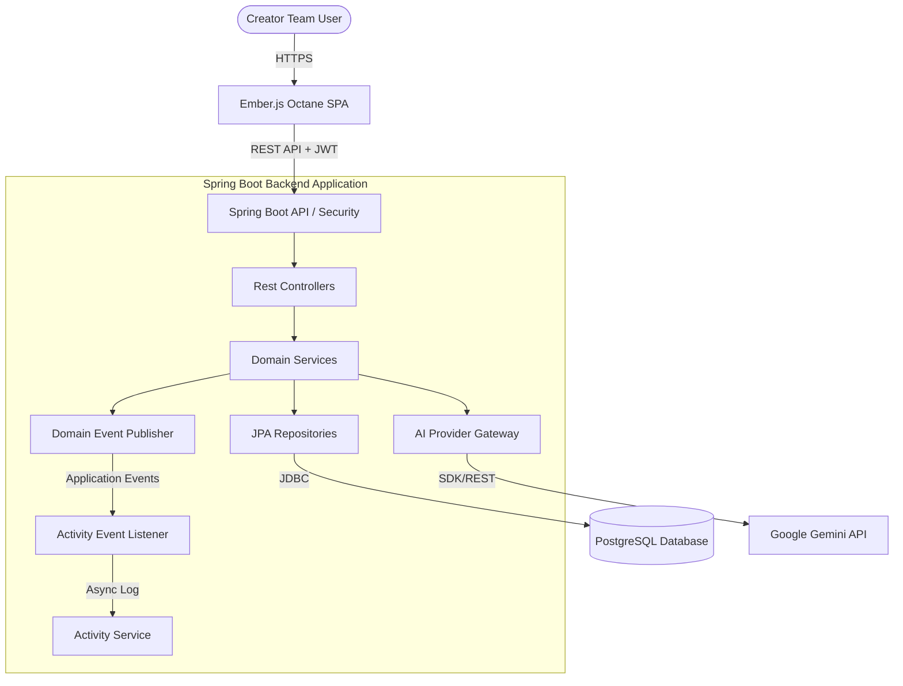

# CreatorOps - Content Operations Platform

[](https://www.oracle.com/java/technologies/downloads/)
[](https://spring.io/projects/spring-boot)
[](https://www.docker.com/)
[](https://github.com/surya-thedeveloper/creatorOps/actions)
[](https://emberjs.com/)
[](LICENSE)

CreatorOps is a production-grade Content Operations Platform (SaaS) built to help modern content creator teams centralize their workflow from initial brainstorming to multi-channel publishing and analytics. It serves as a unified workspace replacing fragmented tools like WhatsApp, Google Docs, Notion, Trello, and spreadsheets.

---

## 🌟 Product Overview

For content creator teams (e.g., SLAY Media) running multiple media brands (e.g., SLAY Fashion, SLAY Fitness, SLAY Tech), managing the production lifecycle is notoriously scattered. Ideas are lost in chat threads, scripts are spread across Google Drives, feedback is chaotic, and analytics are manually aggregated.

**CreatorOps** centralizes the content engine:
*   **Organization & Brand Tenancy**: Hierarchical control over multiple brands under one organization.
*   **Structured Content Lifecycle**: Unified workflow tracking content from `IDEA` to `PUBLISHED`.
*   **Integrated Script & Research Modules**: In-app writing, version control, reference gathering, and AI assistant tools (powered by Google Gemini).
*   **Task & Assignment Engines**: Multi-contributor assignments per content phase, with granular sub-tasks.
*   **Activity Auditing & Timeline**: Complete chronological history of all updates.
*   **Centralized Analytics**: Insights across organizations, brands, and individual contributor performance.

---

## 🛠️ Technology Stack

CreatorOps is architected with a strict separation of concerns, employing a robust Java/Spring backend and a component-driven TypeScript frontend.

### Backend (Backend-First Architecture)
*   **Core Framework**: Java 21 & Spring Boot 3.x
*   **Security**: Spring Security 6 (Stateless JWT, RBAC)
*   **Database**: PostgreSQL 16
*   **Database Migrations**: Flyway
*   **Build Tool**: Maven

### Frontend
*   **Framework**: Ember.js Octane (v5.x)
*   **Language**: TypeScript
*   **Styling**: Tailwind CSS (Utility-first, dark-mode prioritized UI)

### AI Brainstorming & Generation
*   **AI Gateway**: Provider Abstraction Layer
*   **LLM Engine**: Google Gemini (primary), with extensible adapters for OpenAI, Claude, and Ollama.

---

## 🏗️ Architecture Highlights



### Key Architectural Guidelines
1.  **Multi-Tenancy Hierarchy**: Direct mapping of `Organization` $\rightarrow$ `Brand` $\rightarrow$ `Content`.
2.  **Stateless API**: Backend is a stateless REST API secured via JSON Web Tokens (JWT).
3.  **Event-Driven Domain Decoupling**: Business services publish transactional domain events (`DomainEvent`) to a publisher context. An asynchronous event listener converts these into chronological activities post-commit, isolating business states from auditing logic.
4.  **Asynchronous Execution & MDC Preservation**: Background workloads are dispatched to a configured task pool (`creatorOpsAsyncExecutor`) utilizing `MdcTaskDecorator` to copy thread context maps (correlationId, userId, orgId) automatically to prevent diagnostic loss.
5.  **Low-Volatility Caching Boundaries**: Highly volatile resources remain cache-free, while read-intensive, low-volatility database entities (`organizations`, `brands`, `users`) are cached locally using Spring Caching and ConcurrentMapCacheManager. Caches are invalidated immediately upon write operations.
6.  **Pluggable AI Integration**: An abstraction layer decouples core business logic from specific AI provider SDKs, enabling seamless fallback and multi-model routing.
7.  **Database Integrity**: Strict conventions including BIGINT primary keys, UTC timestamp storage (`TIMESTAMPTZ`), VARCHAR-based enum serialization, and transactional safety.

---

## 📂 Documentation Catalog

We maintain clean, detailed architecture and product specifications to guide development. Click the links below to explore the documentation:

*   📖 **[Product Requirements Document](file:///S:/Dev/creatorOps/docs/product-requirements.md)**: Product vision, user personas, comprehensive feature specs, lifecycle state transitions, and RBAC matrix.
*   📐 **[System Architecture](file:///S:/Dev/creatorOps/docs/architecture.md)**: Details on C4 diagrams, backend service decomposition, frontend module design, and the AI provider gateway abstraction.
*   🗄️ **[Database Schema Design](file:///S:/Dev/creatorOps/docs/database-design.md)**: ER Diagram, full entity dictionary, soft delete logic, indexing strategy, and auditing design.
*   🔌 **[API Design Specification](file:///S:/Dev/creatorOps/docs/api-design.md)**: REST endpoint catalog, payload definitions, global error responses, filtering, sorting, and pagination rules.
*   📝 **[Architecture Decision Records (ADR)](file:///S:/Dev/creatorOps/docs/decisions.md)**: Documented architectural decisions, tradeoffs, and accepted designs.
*   🚀 **[Deployment Guide](file:///S:/Dev/creatorOps/docs/deployment.md)**: Step-by-step instructions for running the application in Default (H2), Local PostgreSQL, Docker Compose, or Production modes.

---

## 🔌 API Endpoint Examples

All core REST endpoints are versioned under `/api/v1` to support reliable API contract evolution.

### Authentication & Profiles
*   **POST** `/api/v1/auth/register` — Register a new account
*   **POST** `/api/v1/auth/login` — Authenticate and receive stateless access/refresh tokens
*   **POST** `/api/v1/auth/refresh` — Refresh expired access token
*   **GET** `/api/v1/users/profile` — Get current user settings
*   **PUT** `/api/v1/users/profile` — Update name or avatar URL

### Content Planning & Collaboration
*   **GET** `/api/v1/contents` — Query content cards with tenancy isolation (supports paging/sorting)
*   **POST** `/api/v1/contents` — Create a new content card
*   **POST** `/api/v1/ai/contents/{id}/brainstorm` — Trigger Gemini AI brainstorming report
*   **POST** `/api/v1/ai/contents/{id}/generate-script` — Trigger Gemini AI conversational script drafting

### System Monitoring & Actuator
*   **GET** `/actuator/health` — Returns application status (`UP`)
*   **GET** `/actuator/info` — Exposes build version, stage, and application metadata
*   **GET** `/actuator/metrics` — Exposes JVM and HTTP execution parameters

---

## 🐳 Quick Start with Docker Compose

Spin up the entire backend stack including a PostgreSQL database and the Spring Boot application using a single command:

```bash
# Clone the repository and navigate inside
git clone https://github.com/surya-thedeveloper/creatorOps.git
cd creatorOps

# Setup configuration from template
cp .env.example .env

# Start database and application
docker compose up --build
```

- **CreatorOps API**: Running at `http://localhost:8080/api/v1`
- **Swagger UI**: Accessible at `http://localhost:8080/swagger-ui/index.html`
- **Database**: PostgreSQL exposed locally on port `5432`

---

## 📖 API Documentation (OpenAPI/Swagger)

CreatorOps leverages `springdoc-openapi` to automatically generate comprehensive REST API documentation.

- **Interactive UI**: [http://localhost:8080/swagger-ui/index.html](http://localhost:8080/swagger-ui/index.html)
- **OpenAPI 3.0 Specs JSON**: [http://localhost:8080/v3/api-docs](http://localhost:8080/v3/api-docs)

> [!NOTE]
> Swagger UI and OpenAPI documentation are enabled by default for developer ease, but are explicitly **disabled in the `prod` (production) profile** for security.

---

## ⚙️ Environment Configuration Profiles

The application defines environment-specific property files matching runtime needs:

*   `default`: Embedded H2 database configuration. Zero-dependency setup ideal for unit tests and local mock testing.
*   `local`: Connects to local PostgreSQL instance, with Hibernate SQL logging enabled and verbose logging on debug packages.
*   `postgres` (Docker Compose): Connects to containerized PostgreSQL. Environment credentials loaded from `.env` or system variables.
*   `dev` (Staging): Staging/test environments.
*   `prod` (Production): Production configurations. Disables Swagger, secures actuator endpoints, enforces non-default database and JWT credentials, and optimizes the Hikari Connection Pool.

---

## 🛠️ Continuous Integration (CI)

A GitHub Actions workflow is set up to automate code quality verification on every check-in:

- **CI Trigger**: Every `push` and `pull_request` on `main`/`master` branches.
- **Workflow Pipeline**:
  1. Installs **Java 17 (Eclipse Temurin)** environment.
  2. Sets up **Maven caching** for fast builds.
  3. Executes `mvn verify` (compiles source, runs database tests via H2, validates formats).
  4. Uploads test surefire execution reports as build artifacts on failure/success.

See [.github/workflows/ci.yml](file:///S:/Dev/creatorOps/.github/workflows/ci.yml) for full pipeline specifications.

---

## 📈 Project Status

- [x] Documentation & Architecture Phase (Completed)
- [x] Backend Infrastructure Setup (Spring Boot, Security, PostgreSQL) (Completed)
- [x] Database Schema Migrations (Flyway) (Completed)
- [x] AI Integration Layer (Completed)
- [x] Core REST APIs (Completed)
- [x] Production Readiness (API Versioning, Correlation IDs, Actuator) (Completed)
- [x] System Design Foundations (Domain Events, Async Processing, App Caching) (Completed)
- [x] Engineering Maturity & Deployment Readiness (OpenAPI/Swagger, Docker, Profiles, CI) (Completed)
- [ ] Frontend Workspace Initialization (Ember Octane + TypeScript)
- [ ] Component & UI Shell Layout
- [ ] Core Workspace Integrations
- [ ] End-to-End Testing & Deployment

For a full step-by-step breakdown of setup operations, configurations, and database triggers, consult the **[Deployment Guide](file:///S:/Dev/creatorOps/docs/deployment.md)**.

