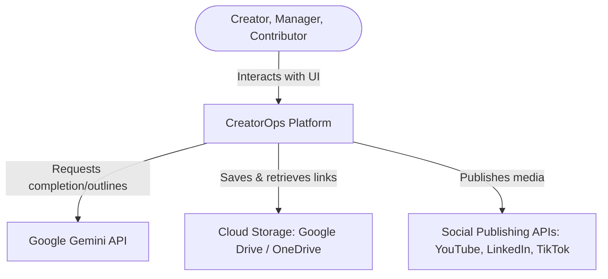
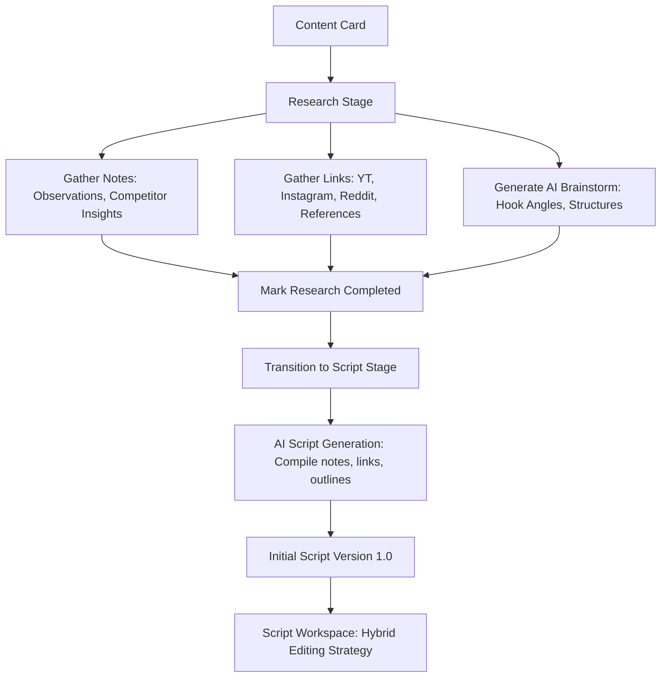
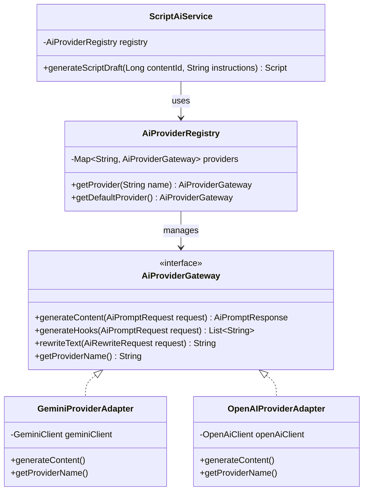
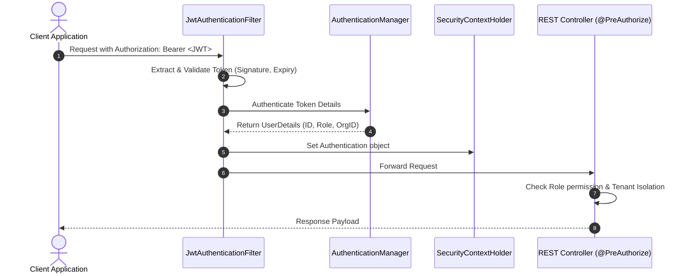

# System Architecture Document

This document outlines the architectural blueprints, subsystem boundaries, data-flow patterns, and component structures for the **CreatorOps** platform.

---

## 1. Architectural Style & C4 Context

CreatorOps uses a decoupled Single Page Application (SPA) frontend and a stateless RESTful Web API backend. The system integrates with cloud services (AI providers, storage drives, and publishing platforms) to run workflows.

### System Context Diagram



### Container Diagram


---

## 2. Backend Architecture (Spring Boot)

The backend is built with **Java 21** and **Spring Boot 3.x**. It is structured around clean DDD (Domain-Driven Design) layered design principles.

### Service Layout & Dependencies
Within the Spring Boot project, files are structured by domain package rather than technical layer to maximize cohesiveness:

```
com.creatorops
├── core
│   ├── config          # Global Spring configuration (Cors, Jackson, Async)
│   ├── security        # Spring Security configuration, JWT filters
│   └── exception       # RFC 7807 Global Exception Handler
├── domain
│   ├── organization    # Org Management domain classes, service, controllers
│   ├── brand           # Brand domain classes, service, controllers
│   ├── content         # Content, lifecycle state machine, tasks, comments
│   ├── research        # Research item handlers (notes, links, scraper)
│   ├── script          # Script editor, version history engine
│   └── assignment      # Contributor assignments, workflow mapping
└── integration
    ├── ai              # Pluggable AI Gateway interface and implementations
    └── storage         # Phase 2: Cloud Storage integration connectors
```

### Layered Architecture Inside a Domain Package
To maintain a strict direction of dependency:
1.  **Web Layer (`*Controller.java`, `*Dto.java`)**: Handles request deserialization, validation, HTTP response mappings, and role-based path authorization.
2.  **Service Layer (`*Service.java`, `*ServiceImpl.java`)**: Transaction boundaries (`@Transactional`), domain validation, business rules, and state machine triggers.
3.  **Persistence Layer (`*Entity.java`, `*Repository.java`)**: JPA mapping to PostgreSQL, custom QueryDSL or JPA query definitions.

### 2.3. Research & Scripting Engine Architecture
The Research and Script modules coordinate to move a content card from information gathering to the physical text workspace.

#### Research-to-Script Data Flow


#### Architecture Responsibilities
*   **Research Module (`com.creatorops.research`)**: Acts as a contextual information compiler associated with specific Content cards. It is **not** a general knowledge wiki replacement. It organizes notes (`NOTE`), competitor references (`LINK`), and prompt outline recommendations (`AI_BRAINSTORM`).
*   **Script Module (`com.creatorops.script`)**: Focuses on text generation, draft storage, and versioning snapshots. It runs after the research stage is marked completed.
*   **Hybrid Workspace Architecture**: The Script Workspace accommodates two editing pathways to minimize workflow restrictions:
    1.  *Internal Editor (Basic Rich Text)*: Web application components rendering custom rich text attributes (headings, bold, italic, underline, bullet lists, numbered lists). State is persisted in `script_version.content` table snapshots.
    2.  *External Document Pointer (Reference)*: Mapped in the metadata, storing copy-paste references to external platforms (Google Docs URLs, Microsoft Word Online URLs) or local file uploads (`.docx` storage paths). No automatic API document synchronization or OAuth overhead in Phase 1 (explicitly deferred to future phases).

---

## 3. Frontend Architecture (Ember.js Octane)

The frontend is a single-page application built on **Ember.js Octane (v5.x)** using **TypeScript** and **Tailwind CSS**. Ember.js enforces a highly structured, convention-over-configuration architecture that ensures scalability.

### Project Layout
```
app/
├── adapters/            # Configures communication with Backend REST APIs (JSONAPIAdapter)
├── components/          # Reusable UI widgets (Tailwind styled)
│   ├── dashboard/       # Dashboard widgets, stats charts
│   ├── content/         # Content kanban card, stage manager
│   ├── script/          # Script editor, history log
│   └── shared/          # Buttons, forms, modals, status tags
├── controllers/         # Manages screen state and actions for routes
├── models/              # TypeScript client-side domain definitions (Ember Data)
├── routes/              # Fetches model data and structures UI hierarchy
├── services/            # Global singletons (Session, AI-Client, Toast-Alert)
├── styles/              # tailwind.css configuration and custom variables
└── templates/           # HTMLBars template markup structures
```

### Core Design Systems
*   **Routing**: Nested routes mapped to the `Organization/Brand` hierarchy (e.g., `/:org_id/:brand_id/contents/:content_id`).
*   **State Management (Ember Data)**: Standardizes data caching, relationship tracking (e.g., `Brand` hasMany `Content`), and API synchronization.
*   **Tailwind Styling**: Dark-theme focus, clean typography (`Inter` or `Outfit`), smooth micro-animations on route transitions and click states.

---

## 4. AI Provider Abstraction Gateway

A major requirement is supporting multiple AI providers. We implement an **Adapter and Gateway Pattern** to decouple content scripts from specific provider SDKs.



### Abstraction Details
*   **`AiPromptRequest`**: Wraps parameters including `promptTemplate`, `modelConfig` (temperature, maxTokens), and contextual values (e.g., brand tone, research notes).
*   **`AiProviderRegistry`**: Dynamic component holding active gateway adapters. Facilitates runtime switching based on configuration database values or custom headers.
*   **Prompt Templating**: Templates are stored in resource bundles or database configs, keeping prompting instructions out of compile-time Java classes.

---

## 5. Security & RBAC Architecture

Securing operations across organizations and enforcement of user permissions is implemented via **Spring Security**.

### Security Flow



### Cross-Cutting Security Directives
1.  **JWT Content**: Tokens contain `sub` (userId), `orgId` (organization identifier), and `roles` (authorities array).
2.  **Method-Level Validation**: Controller endpoints utilize `@PreAuthorize` tags to enforce RBAC rules (e.g., `@PreAuthorize("hasAnyRole('ADMIN', 'MANAGER')")`).
3.  **Tenant Isolation Filter**: A database interceptor (or JPA filter) appends `WHERE organization_id = :currentOrgId` to all query generations, preventing cross-tenant leakage.

---

## 6. Integration Architecture (Phase 2 & 3 Roadmap)

### Google Drive & OneDrive Storage Integration
Instead of duplicating storage, Phase 2 implements cloud storage hooks.
*   Upon transitioning to the `PRODUCTION` stage, a background worker uses the **Google Drive API** or **Microsoft Graph API** to auto-create a folder structure: `/CreatorOps/{OrganizationName}/{BrandName}/{ContentTitle}/`.
*   The API returns a folder link, which is saved as an `Asset` reference in PostgreSQL.

### Social Publishing Engine
*   **OAuth Integration**: Users link their channel credentials (YouTube/LinkedIn OAuth2) at the Brand level.
*   **Scheduler worker**: A scheduled Spring Service (`@Scheduled`) polls for content in the `SCHEDULED` state with a release timestamp less than or equal to the current UTC time.
*   The worker retrieves final video files/metadata and triggers publishing runs, transitioning the content state to `PUBLISHED` upon success.
