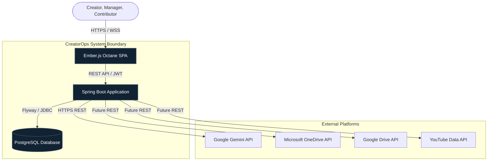
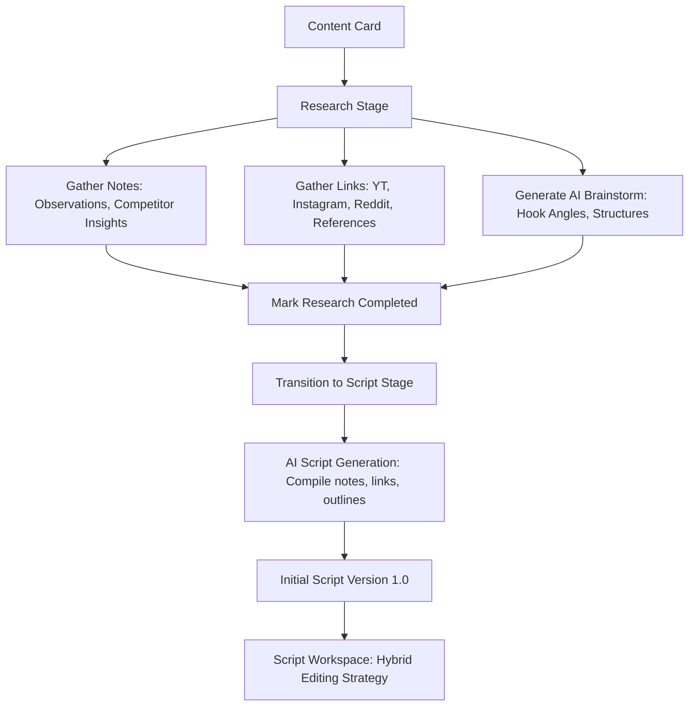
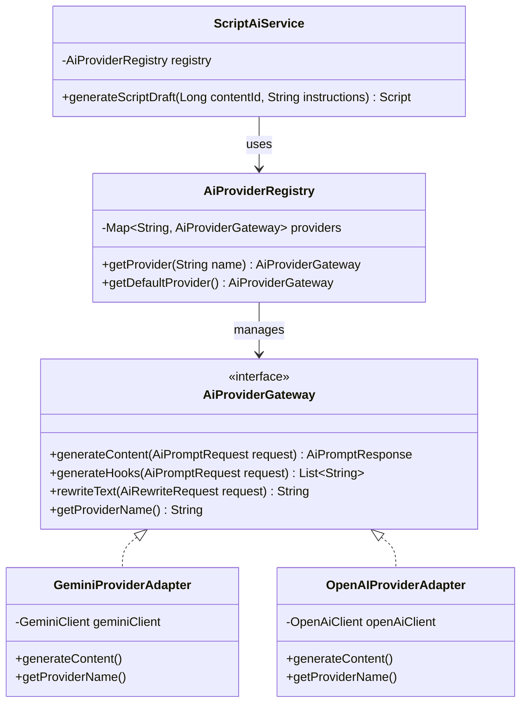
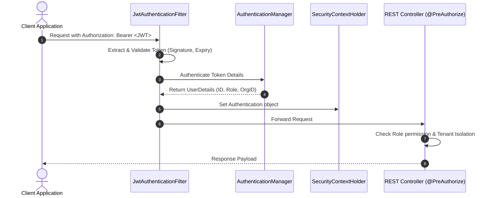

# System Architecture Document

This document outlines the architectural blueprints, subsystem boundaries, data-flow patterns, and component structures for the **CreatorOps** platform.

---

## 1. Architectural Style & C4 Context

CreatorOps uses a decoupled Single Page Application (SPA) frontend and a stateless RESTful Web API backend. The system integrates with cloud services (AI providers, storage drives, and publishing platforms) to run workflows.

### System Context Diagram


### Container Diagram



---

## 2. Backend Architecture (Spring Boot)

The backend is built with **Java 21** and **Spring Boot 3.x**. It is structured around clean DDD (Domain-Driven Design) layered design principles.

### Service Layout & Dependencies
Within the Spring Boot project, files are structured by domain package rather than technical layer to maximize cohesiveness:

```
com.creatorops
├── activity            # Timeline activity log auditing
├── ai                  # Pluggable AI Gateway configurations, adapters, services
├── analytics           # Dashboard summary queries and metric endpoints
├── asset               # URL-based asset management services and endpoints
├── assignment          # Contributor workflow mappings and status boundaries
├── auth                # Security models, JWT validations, user profiles
├── brand               # Tenant sub-channel partitions and brand settings
├── calendar            # Content schedule and agenda projections
├── comment             # Discussion comment threads package-info placeholder
├── common              # Standard base entities, global custom exceptions, RFC 7807 handlers
├── config              # Global configurations (JPA auditing, database initializers, WebSecurity)
├── content             # Core Content cards, lifecycle states, priority lookups
├── organization        # Multi-tenant root entities and organization profiles
├── research            # Context card collectors (notes, URLs, brainstorming)
├── script              # Draft editors, version snapshots, and upload references
└── task                # Checklist sub-tasks nested under assignments
```

### Layered Architecture Inside a Domain Package
To maintain a strict direction of dependency:
1.  **Web Layer (`*Controller.java`, `*Dto.java`)**: Handles request deserialization, validation, HTTP response mappings, and role-based path authorization.
2.  **Service Layer (`*Service.java`, `*ServiceImpl.java`)**: Transaction boundaries (`@Transactional`), domain validation, business rules, and state machine triggers.
3.  **Persistence Layer (`*Entity.java`, `*Repository.java`)**: JPA mapping to PostgreSQL, custom QueryDSL or JPA query definitions.

### 2.3. Research & Scripting Engine Architecture
The Research and Script modules coordinate to move a content card from information gathering to the physical text workspace.

#### Research-to-Script Data Flow


#### Architecture Responsibilities
*   **Research Module (`com.creatorops.research`)**: Acts as a contextual information compiler associated with specific Content cards. It is **not** a general knowledge wiki replacement. It organizes notes (`NOTE`), competitor references (`LINK`), and prompt outline recommendations (`AI_BRAINSTORM`).
*   **Script Module (`com.creatorops.script`)**: Focuses on text generation, draft storage, and versioning snapshots. It runs after the research stage is marked completed.
*   **Hybrid Workspace Architecture**: The Script Workspace accommodates two editing pathways to minimize workflow restrictions:
    1.  *Internal Editor (Basic Rich Text)*: Web application components rendering custom rich text attributes (headings, bold, italic, underline, bullet lists, numbered lists). State is persisted in `script_version.content` table snapshots.
    2.  *External Document Pointer (Reference)*: Mapped in the metadata, storing copy-paste references to external platforms (Google Docs URLs, Microsoft Word Online URLs) or local file uploads (`.docx` storage paths). No automatic API document synchronization or OAuth overhead in Phase 1 (explicitly deferred to future phases).

---

## 3. Frontend Architecture (Ember.js Octane)

The frontend is a single-page application built on **Ember.js Octane (v5.x)** using **TypeScript** and **Tailwind CSS**. Ember.js enforces a highly structured, convention-over-configuration architecture that ensures scalability.

### Project Layout
```
app/
├── adapters/            # Configures communication with Backend REST APIs (JSONAPIAdapter)
├── components/          # Reusable UI widgets (Tailwind styled)
│   ├── dashboard/       # Dashboard widgets, stats charts
│   ├── content/         # Content kanban card, stage manager
│   ├── script/          # Script editor, history log
│   └── shared/          # Buttons, forms, modals, status tags
├── controllers/         # Manages screen state and actions for routes
├── models/              # TypeScript client-side domain definitions (Ember Data)
├── routes/              # Fetches model data and structures UI hierarchy
├── services/            # Global singletons (Session, AI-Client, Toast-Alert)
├── styles/              # tailwind.css configuration and custom variables
└── templates/           # HTMLBars template markup structures
```

### Core Design Systems
*   **Routing**: Nested routes mapped to the `Organization/Brand` hierarchy (e.g., `/:org_id/:brand_id/contents/:content_id`).
*   **State Management (Ember Data)**: Standardizes data caching, relationship tracking (e.g., `Brand` hasMany `Content`), and API synchronization.
*   **Tailwind Styling**: Dark-theme focus, clean typography (`Inter` or `Outfit`), smooth micro-animations on route transitions and click states.

---

## 4. AI Provider Abstraction Gateway

A major requirement is supporting multiple AI providers. We implement an **Adapter and Gateway Pattern** to decouple content scripts from specific provider SDKs.



### Abstraction Details
*   **`AiPromptRequest`**: Wraps parameters including `promptTemplate`, `modelConfig` (temperature, maxTokens), and contextual values (e.g., brand tone, research notes).
*   **`AiProviderRegistry`**: Dynamic component holding active gateway adapters. Facilitates runtime switching based on configuration database values or custom headers.
*   **Prompt Templating**: Templates are stored in resource bundles or database configs, keeping prompting instructions out of compile-time Java classes.

---

## 5. Security & RBAC Architecture

Securing operations across organizations and enforcement of user permissions is implemented via **Spring Security**.

### Security Flow



### Cross-Cutting Security Directives
1.  **JWT Content**: Tokens contain `sub` (userId), `orgId` (organization identifier), and `roles` (authorities array).
2.  **Method-Level Validation**: Controller endpoints utilize `@PreAuthorize` tags to enforce RBAC rules (e.g., `@PreAuthorize("hasAnyRole('ADMIN', 'MANAGER')")`).
3.  **Tenant Isolation Filter**: A database interceptor (or JPA filter) appends `WHERE organization_id = :currentOrgId` to all query generations, preventing cross-tenant leakage.

---

## 6. Production Readiness & Operational Infrastructure

To prepare the modular monolith for high-throughput, observable production environments, the platform implements the following operational safeguards:

### 6.1. Request Correlation Tracking
*   **CorrelationIdFilter**: Every request passing through the servlet container is stamped with a unique `X-Correlation-Id` UUID inside the HTTP headers (generating a new one if missing, or propagating the client-supplied header).
*   **Thread Safety**: The correlation ID is populated in the SLF4J Diagnostic Context (`MDC`) under `correlationId` at the beginning of the request and cleanly pruned via `MDC.clear()` in a `finally` block at request termination to prevent thread pool memory leaks.
*   **Response Header Propagation**: The generated or received correlation ID is returned in the response headers as `X-Correlation-Id` to allow end-to-end trace diagnostics.

### 6.2. Structured Diagnostic Logging
*   **MDC-Driven Logs**: Console log formats are structured to output context metadata automatically on every statement:
    `[correlationId=%X{correlationId}] [userId=%X{userId}] [organizationId=%X{organizationId}] [entityId=%X{entityId}]`
*   **Business Event Focus**: Logging statements are inserted selectively inside domain transactional boundaries (such as registration, login, content updates, task assignments, checklist modifications, and AI generation tasks) to capture clean auditing paths while avoiding excessive debug verbosity.

### 6.3. API Versioning
*   **Path Versioning Strategy**: To ensure backward compatibility for clients and enable reliable evolutionary updates, all core REST endpoints are versioned under the `/api/v1` path prefix.
*   **Mapping Contracts**: Requests targeting legacy `/api` endpoints without the version prefix fail with `404 Not Found`.

### 6.4. Observability & Monitoring (Spring Actuator)
*   **Production-Safe Monitoring**: Spring Boot Actuator is exposed to enable liveness, readiness, and metrics aggregation.
*   **Exposed Endpoints**: Only safe metrics and application descriptors are exposed:
    *   `/actuator/health` — Liveness and readiness indicators.
    *   `/actuator/info` — Build info, version (e.g. `1.0.0`), and metadata.
    *   `/actuator/metrics` — JVM memory metrics, CPU usage, and HTTP statistics.
*   **Endpoint Security**: Non-public or management endpoints are restricted to prevent config exposures.

### 6.5. AI Rate Limiting
*   **Bucket4j Rate Limiting**: The Gemini AI brainstorming and script generation endpoints (`POST /api/v1/ai/contents/{id}/brainstorm` and `POST /api/v1/ai/contents/{id}/generate-script`) are protected using an in-memory token bucket cache.
*   **Per-User Scopes**: Limits are enforced per authenticated `userId`.
*   **Configurable Parameters**: Default capacity limits (e.g. 5 tokens refilled every minute) are declared in `application.yml` and can be overridden via system environment properties without recompiling code.
*   **Rejection Response**: Requests exceeding the capacity limits are rejected immediately with HTTP `429 Too Many Requests` returning RFC 7807 structured JSON error payloads.

### 6.6. API Discoverability & Documentation (OpenAPI/Swagger)
*   **Springdoc-OpenAPI**: Interactive Swagger UI is exposed at `/swagger-ui/index.html` and raw spec JSON at `/v3/api-docs`.
*   **Security Integration**: Fully supports JWT Bearer authentication within the Swagger UI for testing secured endpoints.
*   **Production Safeguards**: Swagger UI is disabled in the `prod` profile to prevent exposing API surface details in production.

### 6.7. Containerization & Isolation (Docker)
*   **Multi-Stage Build**: Utilizes a lean Dockerfile containing a Maven compilation stage followed by an alpine JRE execution runtime stage (~200MB memory footprint).
*   **Non-Root Execution**: Runs under a custom `creatorops` user (UID 1001) rather than root, minimizing the container's security attack surface.
*   **Compose Orchestration**: Couples the app container with a PostgreSQL 16 health-checked database container under a private bridge network, ensuring zero host dependencies for local setup.

### 6.8. Environment Configuration Standardization (Profiles)
*   **Profile Division**: Segregates local development (`local` profile using PG with debug logging), containerized development (`postgres` profile inside Compose), staging (`dev` profile), and production (`prod` profile) properties.
*   **Production Isolation**: Enforces production-only properties (strict secrets, actuator locks, Hikari pool sizing) without defaults to ensure deployment environments are properly configured and secure.

### 6.9. Continuous Integration (GitHub Actions)
*   **Automated Verification**: Runs on all pull requests and pushes to core branches, establishing an automated compilation, Flyway validation, and JUnit testing pipeline using Java 17.

---

## 7. Integration Architecture (Phase 2 & 3 Roadmap)

### Google Drive & OneDrive Storage Integration
Instead of duplicating storage, Phase 2 implements cloud storage hooks.
*   Upon transitioning to the `PRODUCTION` stage, a background worker uses the **Google Drive API** or **Microsoft Graph API** to auto-create a folder structure: `/CreatorOps/{OrganizationName}/{BrandName}/{ContentTitle}/`.
*   The API returns a folder link, which is saved as an `Asset` reference in PostgreSQL.

### Social Publishing Engine
*   **OAuth Integration**: Users link their channel credentials (YouTube/LinkedIn OAuth2) at the Brand level.
*   **Scheduler worker**: A scheduled Spring Service (`@Scheduled`) polls for content in the `SCHEDULED` state with a release timestamp less than or equal to the current UTC time.
*   The worker retrieves final video files/metadata and triggers publishing runs, transitioning the content state to `PUBLISHED` upon success.

---

## 8. Event-Driven Architecture (Domain Events)

To decouple business domains and improve extensibility, CreatorOps uses a lightweight, transaction-aware Event-Driven Architecture.

### Core Components
*   **`DomainEvent`**: Abstract base class representing a past business occurrence. It captures metadata tracing parameters including `eventId`, `occurredAt`, `userId`, `organizationId`, `contentId`, and `entityId`, plus diagnostic descriptions and JSON payload mappings.
*   **`DomainEventPublisher`**: An application wrapper bean delegating publication events to Spring's `ApplicationEventPublisher`. 
*   **`ActivityEventListener`**: A polymorphic event listener capturing all subclass configurations extending `DomainEvent`. It maps events to standard database `Activity` records and calls `ActivityService.record(...)` asynchronously.

### Transaction Isolation
To prevent race conditions where async handler tasks look up entities from the database before database updates are committed, `ActivityEventListener` uses:
`@TransactionalEventListener(phase = TransactionPhase.AFTER_COMMIT)`
This enforces that event processing starts only after database commits succeed.

---

## 9. Asynchronous Processing Foundation

Asynchronous background operations are handled natively in Spring Boot via the `@EnableAsync` config wrapper.

### Thread Pool Configuration (`creatorOpsAsyncExecutor`)
A dedicated Spring TaskExecutor pool handles all non-blocking operations:
*   **Core Pool Size**: 4 threads.
*   **Max Pool Size**: 8 threads.
*   **Queue Capacity**: 100 tasks.
*   **Thread Prefix**: `creatorops-async-`

### Context Propagation (MDC Preservation)
Because Standard ThreadLocal variables do not cross thread boundaries to thread pools, we implement a custom `MdcTaskDecorator`. It automatically captures the SLF4J Diagnostic Context (`MDC`) from the submitting parent thread and populates it inside the execution task thread, assuring correlation IDs and trace claims are preserved inside async logs.

### Exception Handling (`AsyncExceptionHandler`)
An asynchronous uncaught exception handler handles silent execution failures by capturing exceptions thrown inside `@Async` methods and writing structured trace diagnostics to the application logs.

---

## 10. Application Caching Strategy

CreatorOps uses local Spring Boot Caching (`@EnableCaching`) to optimize reads for low-volatility database resources while keeping highly volatile workflow resources cache-free.

### Caching Boundaries
To avoid dirty read states, caching is restricted to low-volatility entities:
*   `organizations` (Cached under `findById`)
*   `brands` (Cached under `findById` and `getBrands`)
*   `users` (Cached under `findByEmail` and `getCurrentUser`)

Highly volatile workflow entities (such as Content, Task, Assignment, Script, Asset, Research, and AI Results) **are NOT cached** because they change frequently.

### Cache Manager
We use a standard, local `ConcurrentMapCacheManager`. No external caching servers (such as Redis) are introduced in Phase 1 to minimize architectural overhead, but namespaces and boundaries are designed to easily swap in a distributed provider in the future.

### Cache Eviction and Invalidation
To enforce data consistency:
*   `@Cacheable` caches query values on reads.
*   `@CacheEvict` invalidates the specific key (or clears the entire namespace via `allEntries = true`) on writes (creates, updates, deletes). For example, updating an organization evicts its cache key, and creating a brand clears the `brands` namespace to invalidate list caches.

---

## 11. Resilience Strategy (Resilience4j Gateway)

To protect external API operations (e.g., Google Gemini AI generation) from downstream timeouts, rate-limiting, and network outages, we integrate Resilience4j.

### Fault Tolerance Patterns
*   **Circuit Breaker**: Isolates Gemini integration under the `geminiAI` key. The circuit opens automatically when the failure rate exceeds 50% within a minimum of 5 consecutive calls. Once open, it fast-fails incoming requests for 10 seconds before transitioning to `HALF_OPEN` to probe system health.
*   **Retry with Exponential Backoff**: Retries failed calls up to 3 times. The backoff interval begins at 500ms and scales exponentially (multiplier: 2.0) to cushion downstream rate limits.
*   **Request Timeouts**: Configured connection (5 seconds) and read (15 seconds) timeouts directly on `RestTemplate` to prevent thread pools from hanging indefinitely.
*   **Fallback Isolation**: Intercepts downstream HTTP exceptions (e.g., 429 Rate Limits, 503 Outages, `CallNotPermittedException`) and maps them to clean application exceptions (`AiGenerationException`) displaying friendly messages and hiding raw JSON/vendor details from users.

---

## 12. Dynamic Feature Flags

To permit light, configuration-driven toggles for specific modules, we implement a lightweight Feature Flags system.

### Properties and Scope
*   **Flags Managed**:
    *   `creatorops.features.ai-enabled`: Master toggle for all AI features.
    *   `creatorops.features.ai-brainstorm-enabled`: Toggles AI Hook/Outlining endpoints.
    *   `creatorops.features.ai-script-enabled`: Toggles AI Script Drafting endpoints.
    *   `creatorops.features.analytics-enabled`: Toggles Analytics Dashboard queries.
*   **Service Evaluation**: Services (e.g., `AIServiceImpl`, `AnalyticsServiceImpl`) consult `FeatureFlagService` before executing logic. If disabled, a `FeatureDisabledException` is thrown, which the `GlobalExceptionHandler` converts to an RFC 7807 `403 Forbidden` response.
*   **Design Decision**: Fully environment-variable driven (in `application.yml`). Database-backed or remote management consoles are deferred to minimize dependency footprint.

---

## 13. Task Scheduling Infrastructure

To orchestrate background maintenance and periodic tasks, scheduling infrastructure is enabled via `@EnableScheduling`.

### Configuration Details
*   **Task Scheduler Pool**: Configured a `ThreadPoolTaskScheduler` with a pool size of 5 and thread prefix `creatorops-scheduler-` to avoid task starvation.
*   **Baseline Infrastructure Jobs**:
    *   `DailyHealthSummaryJob`: Periodic cron running every midnight to check and log backend health.
    *   `OverdueContentScannerJob`: Scans for overdue content cards every 15 minutes and writes logs.
*   **Future Uses**: Easily extensible to support task reminders, automated publishing triggers, cache cleanups, and analytics aggregation jobs.

---

## 14. Business Metrics & Observability

To complement infrastructure metrics provided by Spring Boot Actuator, we define application-level business metrics.

### Custom Micrometer Meters
Custom counters are registered under the Micrometer `MeterRegistry` and exposed via Actuator's `/actuator/metrics`:
*   `creatorops.ai.requests` / `creatorops.ai.success` / `creatorops.ai.failures`: Track AI provider operations.
*   `creatorops.brainstorms.generated` / `creatorops.scripts.generated`: Track AI content production output.
*   `creatorops.content.created` / `creatorops.assignments.created`: Track standard entity creations.
*   `creatorops.tasks.completed`: Track checklist actions marked as `DONE`.
*   `creatorops.ai.circuit.open` / `creatorops.ai.retry.count`: Expose Resilience4j operational performance.

---

## 15. AI Idempotency Protection

To prevent double-billing and duplicate resource generation due to browser double-clicks or network retries, an idempotency engine guards AI endpoints.

### Lifecycle Flow
1.  **Header Interception**: `IdempotencyFilter` intercepts POST calls containing an `Idempotency-Key` header on AI endpoints.
2.  **In-Progress Locking**: If the key is already in the thread-safe `ConcurrentHashMap` with state `IN_PROGRESS`, the request is rejected with `409 Conflict`.
3.  **Completion Caching**: If the state is `COMPLETED`, the filter intercepts and directly writes the cached response payload, headers, and status code to the client.
4.  **Automatic Eviction**: Successful `2xx` responses are stored, while failure states are immediately evicted to permit user retries. A background scheduler runs every hour to clean records older than 24 hours.

---

## 16. Audit Metadata & Client Privacy

Activity logs are enriched with request-level metadata while maintaining strict GDPR/privacy compliance.

### Collected Scope
The `AuditMetadataFilter` extracts and populates Logback's `MDC` with:
*   `requestId` (Unique UUID for correlation mapping)
*   `userAgent` (Request origin client info)
*   `clientIp` (Masked network address)

### Privacy Hardening (IP Masking)
To prevent storing PII in database tables:
*   **IPv4 Addresses**: The last octet is zeroed out (e.g., `192.168.1.123` $\rightarrow$ `192.168.1.0`).
*   **IPv6 Addresses**: The last 80 bits are zeroed out (e.g., `2001:0db8:85a3:0000:0000:8a2e:0370:7334` $\rightarrow$ `2001:db8:85a3::`).
*   **MDC Merging**: The enriched MDC context is asynchronously mapped to the Activity event listener post-commit, merging metadata into the activity's JSON payloads.
