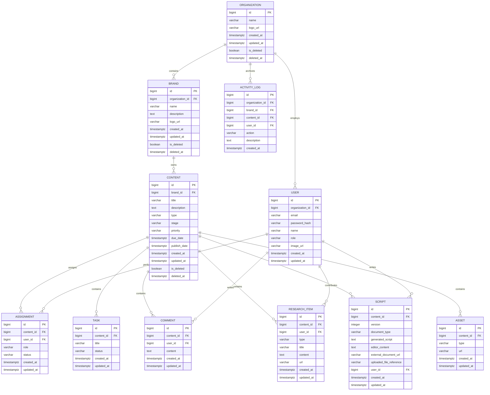
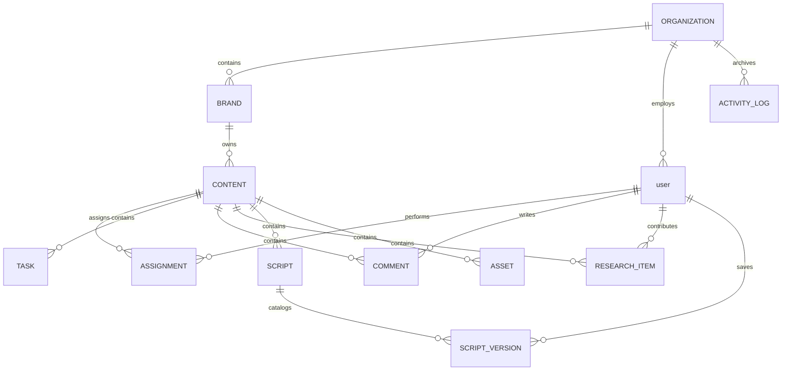

# Database Design Document

This document outlines the physical data model, relationships, field constraints, indexing strategies, and soft delete logic for **CreatorOps**.

---

## 1. Database Conventions

All tables in the CreatorOps system must conform to the following architectural conventions:

1.  **Primary Keys**: Every table must use a `BIGINT` data type mapping to a database sequence or identity column (`BIGSERIAL` or `IDENTITY` in PostgreSQL).
2.  **Table Naming**: Singular table names (e.g., `organization`, `brand`, `content`).
3.  **Column Naming**: Lowercase snake_case (e.g., `created_at`, `is_deleted`).
4.  **Enum Storage**: Enums must be serialized as `VARCHAR` (e.g., `VARCHAR(50)`). Ordinals are strictly forbidden to ensure schema readability and ease of modifications.
5.  **Timezone Standard**: All temporal columns must use `TIMESTAMPTZ` (Timestamp with Timezone support) and must be stored in UTC format.
6.  **Audit Columns**: Major entities (Tenant entities and content-related metadata) must include `created_at` and `updated_at` timestamps.

---

## 2. Entity-Relationship Diagram (ERD)

---

## 3. Entity Descriptions & Dictionary

### 3.1. Tenant & Identity Entities

#### `organization`
Represents the root enterprise client. Multi-tenant root.
*   `id`: `BIGINT`, Primary Key, Auto-increment.
*   `name`: `VARCHAR(255)`, Not Null.
*   `logo_url`: `VARCHAR(1024)`, Null.
*   `created_at`: `TIMESTAMPTZ`, Not Null, Default `CURRENT_TIMESTAMP`.
*   `updated_at`: `TIMESTAMPTZ`, Not Null, Default `CURRENT_TIMESTAMP`.
*   `is_deleted`: `BOOLEAN`, Not Null, Default `FALSE`.
*   `deleted_at`: `TIMESTAMPTZ`, Null.

#### `user`
Represents employees/members of an organization.
*   `id`: `BIGINT`, Primary Key, Auto-increment.
*   `organization_id`: `BIGINT`, Foreign Key references `organization(id)`, Not Null.
*   `email`: `VARCHAR(255)`, Unique, Not Null.
*   `password_hash`: `VARCHAR(255)`, Not Null.
*   `name`: `VARCHAR(100)`, Not Null.
*   `role`: `VARCHAR(50)`, Not Null. Allowed values: `ADMIN`, `MANAGER`, `CONTRIBUTOR`.
*   `image_url`: `VARCHAR(1024)`, Null.
*   `created_at`: `TIMESTAMPTZ`, Not Null, Default `CURRENT_TIMESTAMP`.
*   `updated_at`: `TIMESTAMPTZ`, Not Null, Default `CURRENT_TIMESTAMP`.

#### `brand`
Represents a specific content brand or distribution channel.
*   `id`: `BIGINT`, Primary Key, Auto-increment.
*   `organization_id`: `BIGINT`, Foreign Key references `organization(id)`, Not Null.
*   `name`: `VARCHAR(255)`, Not Null.
*   `description`: `TEXT`, Null.
*   `logo_url`: `VARCHAR(1024)`, Null.
*   `created_at`: `TIMESTAMPTZ`, Not Null, Default `CURRENT_TIMESTAMP`.
*   `updated_at`: `TIMESTAMPTZ`, Not Null, Default `CURRENT_TIMESTAMP`.
*   `is_deleted`: `BOOLEAN`, Not Null, Default `FALSE`.
*   `deleted_at`: `TIMESTAMPTZ`, Null.

---

### 3.2. Content Domain Entities

#### `content`
The central repository card representing a piece of planned media.
*   `id`: `BIGINT`, Primary Key, Auto-increment.
*   `brand_id`: `BIGINT`, Foreign Key references `brand(id)`, Not Null.
*   `title`: `VARCHAR(255)`, Not Null.
*   `description`: `TEXT`, Null.
*   `type`: `VARCHAR(50)`, Not Null (Enum values: `YOUTUBE_VIDEO`, `REEL`, `SHORT`, `BLOG`, `LINKEDIN_POST`, `PODCAST`, `OTHER`).
*   `stage`: `VARCHAR(50)`, Not Null (Enum values: `IDEA`, `RESEARCH`, `SCRIPT`, `PRODUCTION`, `EDITING`, `REVIEW`, `SCHEDULED`, `PUBLISHED`, `ON_HOLD`, `CANCELLED`).
*   `priority`: `VARCHAR(50)`, Not Null, Default `'MEDIUM'` (Enum values: `LOW`, `MEDIUM`, `HIGH`, `CRITICAL`).
*   `due_date`: `TIMESTAMPTZ`, Null.
*   `publish_date`: `TIMESTAMPTZ`, Null.
*   `created_at`: `TIMESTAMPTZ`, Not Null, Default `CURRENT_TIMESTAMP`.
*   `updated_at`: `TIMESTAMPTZ`, Not Null, Default `CURRENT_TIMESTAMP`.
*   `is_deleted`: `BOOLEAN`, Not Null, Default `FALSE`.
*   `deleted_at`: `TIMESTAMPTZ`, Null.

#### `assignment`
Maps users (contributors/managers) to specific roles on a content card.
*   `id`: `BIGINT`, Primary Key, Auto-increment.
*   `content_id`: `BIGINT`, Foreign Key references `content(id)`, Not Null, Cascade Delete.
*   `user_id`: `BIGINT`, Foreign Key references `user(id)`, Not Null.
*   `role`: `VARCHAR(100)`, Not Null. Represents the job assigned (e.g., `'Research'`, `'Script'`, `'Editing'`).
*   `status`: `VARCHAR(50)`, Not Null, Default `'PENDING'` (Enum values: `PENDING`, `IN_PROGRESS`, `COMPLETED`).
*   `created_at`: `TIMESTAMPTZ`, Not Null, Default `CURRENT_TIMESTAMP`.
*   `updated_at`: `TIMESTAMPTZ`, Not Null, Default `CURRENT_TIMESTAMP`.

#### `task`
Actionable checklist tasks nested within a content card.
*   `id`: `BIGINT`, Primary Key, Auto-increment.
*   `content_id`: `BIGINT`, Foreign Key references `content(id)`, Not Null, Cascade Delete.
*   `title`: `VARCHAR(255)`, Not Null.
*   `status`: `VARCHAR(50)`, Not Null, Default `'TODO'` (Enum values: `TODO`, `IN_PROGRESS`, `DONE`).
*   `created_at`: `TIMESTAMPTZ`, Not Null, Default `CURRENT_TIMESTAMP`.
*   `updated_at`: `TIMESTAMPTZ`, Not Null, Default `CURRENT_TIMESTAMP`.

---

### 3.3. Content Context Modules

#### `comment`
Threaded discussions within a content card.
*   `id`: `BIGINT`, Primary Key, Auto-increment.
*   `content_id`: `BIGINT`, Foreign Key references `content(id)`, Not Null, Cascade Delete.
*   `user_id`: `BIGINT`, Foreign Key references `user(id)`, Not Null.
*   `content`: `TEXT`, Not Null.
*   `created_at`: `TIMESTAMPTZ`, Not Null, Default `CURRENT_TIMESTAMP`.
*   `updated_at`: `TIMESTAMPTZ`, Not Null, Default `CURRENT_TIMESTAMP`.

#### `research_item`
Research notes, outlines, or URL links linked to content.
*   `id`: `BIGINT`, Primary Key, Auto-increment.
*   `content_id`: `BIGINT`, Foreign Key references `content(id)`, Not Null, Cascade Delete.
*   `user_id`: `BIGINT`, Foreign Key references `user(id)`, Not Null.
*   `type`: `VARCHAR(50)`, Not Null (Enum values: `NOTE`, `LINK`, `AI_BRAINSTORM`).
*   `title`: `VARCHAR(255)`, Not Null.
*   `content`: `TEXT`, Null (Required for `NOTE` & `AI_BRAINSTORM`).
*   `url`: `VARCHAR(1024)`, Null (Required for `LINK`).
*   `created_at`: `TIMESTAMPTZ`, Not Null, Default `CURRENT_TIMESTAMP`.
*   `updated_at`: `TIMESTAMPTZ`, Not Null, Default `CURRENT_TIMESTAMP`.

#### `script`
Container tracking script versions, rich text, and external references on a content card.
*   `id`: `BIGINT`, Primary Key, Auto-increment.
*   `content_id`: `BIGINT`, Foreign Key references `content(id)`, Not Null, Cascade Delete.
*   `version`: `INTEGER`, Not Null.
*   `document_type`: `VARCHAR(50)`, Not Null, Default `'INTERNAL'`. Enum values: `INTERNAL`, `GOOGLE_DOC`, `MS_WORD`, `UPLOADED_FILE`. Indicates the active script workspace workflow chosen by the user.
*   `generated_script`: `TEXT`, Null. Storing the initial AI script draft generated from research inputs.
*   `editor_content`: `TEXT`, Null. Storing the editor content of the script when edited internally.
*   `external_document_url`: `VARCHAR(1024)`, Null. Stores the URL reference to the external document (e.g. Google Docs or Microsoft Word Online).
*   `uploaded_file_reference`: `VARCHAR(1024)`, Null. Stores the file name/path reference for uploaded script files.
*   `user_id`: `BIGINT`, Foreign Key references `user(id)`, Not Null.
*   `created_at`: `TIMESTAMPTZ`, Not Null, Default `CURRENT_TIMESTAMP`.
*   `updated_at`: `TIMESTAMPTZ`, Not Null, Default `CURRENT_TIMESTAMP`.

#### `asset`
Phase 1 asset manager (URL reference repository).
*   `id`: `BIGINT`, Primary Key, Auto-increment.
*   `content_id`: `BIGINT`, Foreign Key references `content(id)`, Not Null, Cascade Delete.
*   `type`: `VARCHAR(50)`, Not Null (Enum values: `RAW_VIDEO`, `EDITED_VIDEO`, `THUMBNAIL`, `OTHER`).
*   `url`: `VARCHAR(1024)`, Not Null.
*   `created_at`: `TIMESTAMPTZ`, Not Null, Default `CURRENT_TIMESTAMP`.
*   `updated_at`: `TIMESTAMPTZ`, Not Null, Default `CURRENT_TIMESTAMP`.

---

### 3.4. Activity Logging

#### `activity_log`
Chronological operations journal tracking changes across brands and content.
*   `id`: `BIGINT`, Primary Key, Auto-increment.
*   `organization_id`: `BIGINT`, Foreign Key references `organization(id)`, Not Null.
*   `brand_id`: `BIGINT`, Foreign Key references `brand(id)`, Null.
*   `content_id`: `BIGINT`, Foreign Key references `content(id)`, Null.
*   `user_id`: `BIGINT`, Foreign Key references `user(id)`, Not Null.
*   `action`: `VARCHAR(100)`, Not Null (e.g. `'CONTENT_CREATED'`, `'ASSIGNMENT_UPDATED'`).
*   `description`: `TEXT`, Not Null.
*   `created_at`: `TIMESTAMPTZ`, Not Null, Default `CURRENT_TIMESTAMP`.

---

## 4. Deletion Strategy (Soft vs Hard)

### Soft Delete Strategy
The following central tenant entities support soft deletions:
*   `organization`
*   `brand`
*   `content`

When deleting these records:
1.  Set `is_deleted = TRUE` and `deleted_at = CURRENT_TIMESTAMP`.
2.  **Cascade Logic**:
    *   If an `organization` is soft deleted, the system marks all child `brand` and `content` records as soft deleted.
    *   If a `brand` is soft deleted, all child `content` records are soft deleted.
3.  **Query Filtering**:
    *   All select queries targeting `organization`, `brand`, or `content` must inject `WHERE is_deleted = FALSE` dynamically (e.g. using Hibernate `@SQLDelete` and `@Where` annotations).

### Hard Delete Strategy
The following supporting metadata entities are **hard deleted** (physical deletion from disk):
*   `task`
*   `comment`
*   `script`
*   `asset`
*   `activity_log`
*   `research_item`

To avoid foreign key constraints orphans, foreign keys pointing to parent tables are declared with `ON DELETE CASCADE`. For example, deleting a `content` record (hard or soft) cascades cleanups down to its dependent task lists and commentaries.

---

## 5. Indexing Strategy

To keep database access fast as content records scale, we prioritize specific column indexes:

### 1. Unique Constraints & Lookup Keys
*   `user(email)`: Implicit index created by the `UNIQUE` constraint. Used at login authentication.

### 2. Foreign Key Indexes
Database constraints protect data integrity but do not automatically add lookup performance. We index all foreign keys to optimize joins:
*   `user(organization_id)`
*   `brand(organization_id)`
*   `content(brand_id)`
*   `assignment(content_id)`, `assignment(user_id)`
*   `task(content_id)`
*   `comment(content_id)`
*   `research_item(content_id)`
*   `script(content_id)`
*   `script(user_id)`
*   `asset(content_id)`
*   `activity_log(organization_id)`, `activity_log(content_id)`

### 3. Partial & Performance Indexes
*   **Soft Delete Indexing**: Since major queries filter out deleted items, composite indexes containing `is_deleted` improve performance:
    *   `idx_brand_org_deleted` $\rightarrow$ `brand(organization_id, is_deleted)`
    *   `idx_content_brand_deleted` $\rightarrow$ `content(brand_id, is_deleted)`
*   **Kanban Workflow Optimization**:
    *   `idx_content_stage_due` $\rightarrow$ `content(brand_id, stage, due_date)` (Used for board filters and due date notifications).

---

# Entity Relationship Diagram (ERD)

This section presents the visual modeling, relationship rules, and architectural insights validating the database layout of **CreatorOps**.

## 1. Physical vs. Logical Membership Representation

In the current physical database schema (**V1**), the logical concept of **membership** is denormalized directly into the `"user"` table. 
*   **Logical Membership**: Decouples identity (authentication credentials) from tenant context (authorization role and organization association).
*   **Physical Realization**: In **V1**, each User belongs to exactly one Organization and holds a single organizational role. To optimize query performance and eliminate unnecessary join tables during boot, this is physically implemented via `user.organization_id` and `user.role`.
*   **Deferred Extension**: Introducing a separate physical `membership` table is deferred to Phase 2 to support multi-tenant user access (e.g. contributors working across multiple organizations with a single login).

The physical schema ERD below reflects the exact implemented PostgreSQL schema.

---

## 2. Mermaid Entity Relationship Diagram

---

## 3. Detailed Entity Relationship Explanation

### organization
*   **Purpose**: The primary multi-tenant partition root.
*   **Parent Entity**: None.
*   **Child Entities**: `brand`, `"user"`, `activity_log`.
*   **Business Responsibility**: Enforces structural and database partition isolation. Defines the billing tier boundary and root profile settings (e.g. name, custom tenant logo url).

### user
*   **Purpose**: Represents authenticated credentials and profile details.
*   **Parent Entity**: `organization` (via `organization_id`).
*   **Child Entities**: `assignment`, `comment`, `research_item`, `script_version`.
*   **Business Responsibility**: Manages system entry credentials, secures sessions via hashed passwords, holds custom profile pictures, and logs active participation metadata.

### membership (Logical Entity)
*   **Purpose**: Resolves the association between a User and their Organization role.
*   **Parent Entity**: `organization`, `"user"`.
*   **Child Entities**: None.
*   **Business Responsibility**: Associates authorization contexts (e.g. roles like `ADMIN`, `MANAGER`, `CONTRIBUTOR`) and invites. In the physical V1 schema, this logical module is denormalized directly inside the `"user"` table.

### brand
*   **Purpose**: Partitioned content channel workspace.
*   **Parent Entity**: `organization`.
*   **Child Entities**: `content`.
*   **Business Responsibility**: Groups related content plans (e.g. YouTube channels, specific blogs) while utilizing the organization's user base.

### content
*   **Purpose**: Core planner item card representing a publication target.
*   **Parent Entity**: `brand`.
*   **Child Entities**: `assignment`, `task`, `comment`, `research_item`, `script`, `asset`.
*   **Business Responsibility**: Coordinates the creative stages (`IDEA` to `PUBLISHED`), priorities, due dates, and links related creative modules.

### assignment
*   **Purpose**: Maps creator roles to content execution cards.
*   **Parent Entity**: `content` (via `content_id`), `"user"` (via `user_id`).
*   **Child Entities**: None.
*   **Business Responsibility**: Outlines team task assignments (e.g., Writer, Editor) and progress tracking (`PENDING`, `IN_PROGRESS`, `COMPLETED`).

### task
*   **Purpose**: Lightweight checklist sub-item under content cards.
*   **Parent Entity**: `content`.
*   **Child Entities**: None.
*   **Business Responsibility**: Tracks execution tasks (e.g. "design thumbnail", "record audio voiceover") with a simple toggle state (`TODO`, `IN_PROGRESS`, `DONE`).

### research_item
*   **Purpose**: Reference references and AI outlines linked to content.
*   **Parent Entity**: `content` (via `content_id`), `"user"` (via `user_id`).
*   **Child Entities**: None.
*   **Business Responsibility**: Integrates markdown notes, competitor links, and raw brainstorm data into the scriptwriting workflow.

### script
*   **Purpose**: Collaborative text container representing script draft versions.
*   **Parent Entity**: `content` (via `content_id`), `"user"` (via `user_id`).
*   **Child Entities**: None.
*   **Business Responsibility**: Anchors the script version details (internal rich-text or external document references) and user/auditing context.

### asset
*   **Purpose**: Reference files registry.
*   **Parent Entity**: `content`.
*   **Child Entities**: None.
*   **Business Responsibility**: Holds external storage URL endpoints (e.g. Google Drive raw files, thumbnails, final render cuts) cataloged by type.

### comment
*   **Purpose**: In-app discussion threads.
*   **Parent Entity**: `content` (via `content_id`), `"user"` (via `user_id`).
*   **Child Entities**: None.
*   **Business Responsibility**: Facilitates peer review and feedback directly adjacent to the content planning details.

### activity_log (activity)
*   **Purpose**: Chronological system operations audit journal.
*   **Parent Entity**: `organization` (via `organization_id`), `brand` (optional), `content` (optional), `"user"` (via `user_id`).
*   **Child Entities**: None.
*   **Business Responsibility**: Records lifecycle status changes, assignments, and structural modifications to build an audit history of the creative pipeline.

---

## 4. Cardinality Validation

*   **Strict One-to-Many Mappings**:
    *   `organization` to `brand` ($1:\text{Many}$): Valid. One tenant organization can contain multiple sub-brands (e.g. SLAY Media Group owns SLAY Tech and SLAY Fashion).
    *   `brand` to `content` ($1:\text{Many}$): Valid. Each content card is owned by a single brand channel.
    *   `content` to metadata children (`task`, `asset`, `comment`, `research_item`) ($1:\text{Many}$): Valid. Supports multiple checklist items, files, and discussion logs grouped under the content card.
*   **Strict Many-to-One / Many-to-Many Resolvers**:
    *   `content` $\leftrightarrow$ `"user"` (Many-to-Many): Resolved cleanly via the `assignment` join table containing context fields (`role`, `status`).
    *   `script` $\leftrightarrow$ `"user"` (Many-to-One): Multiple script versions point to the user contributor who performed the save.
    *   `organization` $\leftrightarrow$ `"user"` (One-to-Many in V1): A user is physically mapped to one organization. 
*   **Design Considerations & Safety Controls**:
    *   *No Unintended Many-to-Many Loops*: No circular reference dependencies exist in the primary data structures.
    *   *Integrity Safeguards*: Root models (`organization`, `brand`, `content`) enforce soft deletions, while child collections (`task`, `comment`, `script`) utilize physical database cascade deletes (`ON DELETE CASCADE`) to prevent orphaned rows.

---

## 5. Architectural Review & Scalability Insights

*   **Scaling Potential (Multi-Tenant User Accounts)**:
    *   The direct link between `"user"` and `organization` in V1 restricts a user to exactly one tenant. For phase 2, migrating to a separate `membership` table will allow users (like freelance video editors) to switch between different organizations (tenants) using a single email registration.
*   **Audit Log Partitioning**:
    *   The `activity_log` table will accumulate rows faster than any other table. Archiving or partitioning this table using PostgreSQL range partitioning on the `created_at` timestamp will keep primary transaction speeds fast as tables scale.
*   **Asset Management Extensions**:
    *   V1 stores assets strictly as URLs. The schema index layout (`idx_asset_content_id`) is designed to support a future extension linking directly to cloud-native storage assets (e.g., AWS S3 keys or Google Drive file IDs) without table structural changes.

