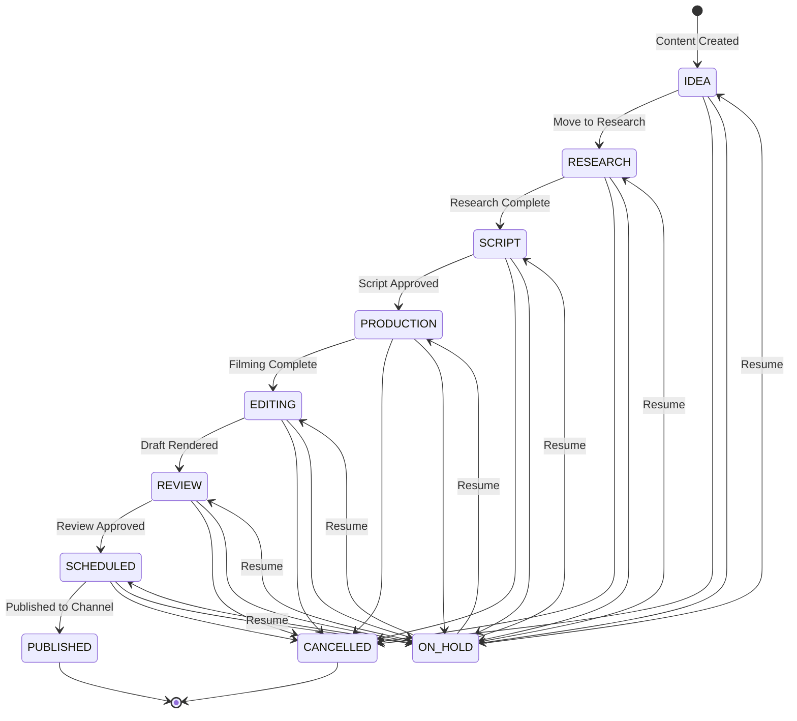

# Product Requirements Document (PRD)

## 1. Problem Statement & Target Audience

### The Problem
Modern content creator teams operate in highly fragmented environments. A typical piece of content (e.g., a YouTube video or a LinkedIn post) undergoes a chaotic journey:
1.  **Ideation & Planning**: Brainstormed in WhatsApp groups or custom Trello boards.
2.  **Research**: Links, references, and competitor analyses are saved in individual browser bookmarks, Slack messages, or local files.
3.  **Scriptwriting & Storyboarding**: Written in Google Docs, leading to version control confusion.
4.  **Team Assignment**: Coordination happens over chats (e.g., "Akash, please do research; Gowtham, edit this").
5.  **Asset Management**: Raw clips, thumbnails, and final drafts are uploaded to disorganized Google Drive folders, with links shared on WhatsApp.
6.  **Analytics**: Performance tracking is done manually in Excel sheets.

This fragmentation leads to missed deadlines, lost research, miscommunication between creators and editors, and inefficient workflows that stifle creative output.

### Target Audience
*   **Media Agencies & Large Creator Houses** (e.g., SLAY Media) managing multiple channels and brands.
*   **Production Managers & Editors** coordinating assets, tasks, and publication dates.
*   **Independent Creators & Contributors** looking to streamline scriptwriting, research, and scheduling in a central place.

---

## 2. Product Vision

**CreatorOps** is the central Content Operations Platform (SaaS) that unifies content planning, research, scriptwriting, assignment coordination, asset tracking, and analytics. It turns creative chaos into a structured assembly line, empowering creator teams to scale their production without administrative overhead.

---

## 3. User Personas

1.  **Tony (The Agency Admin/Creator Owner)**:
    *   *Need*: Wants full visibility across all brands (Tech, Fashion, Fitness) under his agency. Needs to manage team roles, review high-level analytics, and control billing and organization-wide integrations.
2.  **Rogers (The Production Manager)**:
    *   *Need*: Needs to manage the content pipeline. Assigns scripts to writers, review requests to editors, and schedules the final outputs. Wants to see what content is blocked and who is working on what.
3.  **Bruce (The Video Editor / Contributor)**:
    *   *Need*: Wants a clean queue of assigned tasks and scripts. Needs easy access to raw asset links, instructions, and comments from the manager. Wants to drop final edited links directly on the content card for approval.

---

## 4. Role-Based Access Control (RBAC)

CreatorOps operates with a strict, hierarchical role system. Every user is mapped to a specific role within their Organization.

| Feature Area | ADMIN | MANAGER | CONTRIBUTOR |
| :--- | :---: | :---: | :---: |
| **Organization Settings** (Update, Delete) | ✅ | ❌ | ❌ |
| **Manage Brands** (Create, Update, Archive) | ✅ | ❌ | ❌ |
| **Manage Users** (Invite, Remove, Role Changes) | ✅ | ❌ | ❌ |
| **Content Management** (Create, Update, Delete) | ✅ | ✅ | ❌ (View Only) |
| **Content Assignments** (Assign, Update Status) | ✅ | ✅ | ❌ |
| **Research & Scripts** (Create, Read, Update) | ✅ | ✅ | ✅ (Assigned only) |
| **Script AI Features** (Generate, Rewrite, Hook) | ✅ | ✅ | ✅ (Assigned only) |
| **Task Management** (Add, Complete, Delete) | ✅ | ✅ | ✅ (Complete/Update) |
| **Asset Module** (Add URLs, Update type) | ✅ | ✅ | ✅ |
| **Comment System** (Post, Read) | ✅ | ✅ | ✅ |
| **System Analytics** (View Dashboards) | ✅ | ✅ | ✅ |

---

## 5. Feature Specifications

### 5.1. Organization & Brand Tenancy
*   **Multi-Tenancy**: The application is partitioned by `Organization`. All data (Brands, Content, Users) belongs to an Organization.
*   **Brands**: Within an Organization, users can spin up multiple sub-brands (e.g., "SLAY Fashion", "SLAY Tech"). Both Organizations and Brands support customized logos to personalize the platform workspace.
*   **Data Isolation**: Under no circumstances can a user from Organization A access data belonging to Organization B.
*   **User Profile & Avatars**: Users can update their names and upload profile pictures. Profile images are rendered on content cards, assignment modules, discussions, and the activity log to provide clear visual cues for team assignments.

### 5.2. Content Management
*   **Content Cards**: The core entity. Contains:
    *   `Title` (string, required)
    *   `Description` (text)
    *   `Type` (Enum: `YOUTUBE_VIDEO`, `REEL`, `SHORT`, `BLOG`, `LINKEDIN_POST`, `PODCAST`, `OTHER`)
    *   `Stage` (Enum: `IDEA`, `RESEARCH`, `SCRIPT`, `PRODUCTION`, `EDITING`, `REVIEW`, `SCHEDULED`, `PUBLISHED`, `ON_HOLD`, `CANCELLED`)
    *   `Priority` (Enum: `LOW`, `MEDIUM`, `HIGH`, `CRITICAL`)
    *   `Due Date` (TIMESTAMPTZ, optional)
    *   `Publish Date` (TIMESTAMPTZ, optional)
*   **Filtering & Sorting**: Ability to filter by Brand, Stage, Type, Assignee, and Sort by Due Date or Priority.

### 5.3. Research Module
*   **Research Items**: Belong to a specific Content card.
*   **Types**:
    *   `NOTE`: Simple rich-text annotations.
    *   `LINK`: URLs to references (competitor videos, blog posts, articles) with metadata fetch capability.
    *   `AI_BRAINSTORM`: Ideas, outlines, and titles generated via AI models.

### 5.4. Script Module & AI Integration
*   **Script Editor**: Collaborative text editor supporting Markdown.
*   **Versioning**: Automatically saves snapshots when major changes occur. Supports viewing and restoring historical drafts.
*   **AI Operations (Powered by Google Gemini)**:
    *   *Script Generation*: Generate a draft based on the Content title, type, and research notes.
    *   *Hook Generation*: Create 5 hook variations optimized for user retention (specifically for shorts, reels, or video intros).
    *   *Script Improvement/Rewrite*: Tone adjustment, shortening, and expansion commands.

### 5.5. Asset Tracking (Phase 1)
*   **URL-Based Storage**: To minimize early-stage infrastructure costs, assets are stored as raw URLs.
*   **Asset Classification**:
    *   `RAW_VIDEO`: Reference to raw footage (e.g., Google Drive link).
    *   `EDITED_VIDEO`: Reference to a draft editor cut or the final export.
    *   `THUMBNAIL`: Reference to image designs.
    *   `OTHER`: Scripts, audio overlays, sound effect packs.

### 5.6. Assignment & Task Module
*   **Granular Assignments**: Multiple contributors can be assigned to different facets of a single Content piece.
    *   Assignee role assignment (e.g., Writer $\rightarrow$ Surya, Editor $\rightarrow$ Gowtham).
    *   `Assignment Status`: `PENDING`, `IN_PROGRESS`, `COMPLETED`.
*   **Checklist Tasks**: Lightweight checklists inside the content card.
    *   Fields: `Title`, `Is Completed` (`TODO`, `IN_PROGRESS`, `DONE`).
    *   Hard deletion allowed for tasks.

### 5.7. Collaboration & Audit
*   **Comments**: Contextual comments nested inside Content cards.
*   **Activity Timeline**: Automatically logs audit entries on major events:
    *   Content card creation.
    *   Assigning users.
    *   Lifecycle stage changes (e.g., "Akash moved stage from RESEARCH to SCRIPT").
    *   Script version saves.

---

## 6. Detailed Workflows

### 6.1. Content Lifecycle State Machine

The core value proposition of CreatorOps is moving a content item through a defined state pipeline:

### 6.2. Script Generation and Refinement Loop
1.  User creates a Content card with Title: "10 Coding Habits that Will Make You a Staff Engineer".
2.  Contributor adds three `LINK` research items (competitor video links and articles).
3.  Contributor clicks "AI Brainstorm" inside the Script module.
4.  System compiles the Content metadata and Research links, sending a prompt to the AI Gateway.
5.  Gemini returns an outline. The Contributor edits the outline.
6.  Contributor clicks "Generate Full Script". The system returns a full voice-over script.
7.  The editor saves version 1.0. The script is ready for the production phase.

---

## 7. Success Metrics

To validate the product during portfolio reviews and live usage:
*   **Time-to-Publish Efficiency**: Reduction in days a content piece spends in the `SCRIPT` $\rightarrow$ `REVIEW` phase.
*   **AI Integration Utilization**: Number of script revisions and hooks generated in-app.
*   **Collaboration Activity**: Comment thread frequency and assignment completion rate.
*   **Platform Retention**: Frequency of daily content planning interactions.

---

## 8. Future Roadmap

*   **Phase 2: Cloud Storage Integration**:
    *   Direct integrations with Google Drive API and Microsoft OneDrive.
    *   Automatic folder creation per Brand and Content card.
    *   Direct in-app thumbnail preview and video draft streaming.
*   **Phase 3: Multi-Channel Publishing**:
    *   API connections to YouTube Data API, LinkedIn API, TikTok API, and Instagram Graph API.
    *   Scheduled push publishing directly from the platform.
*   **Phase 4: Automatic Analytics Ingestion**:
    *   Daily ingestion of views, click-through-rates (CTR), impressions, and retention graphs directly into the CreatorOps dashboard.
